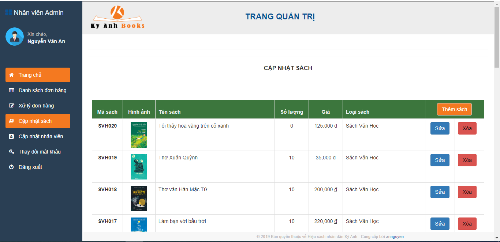

# 
KyAnhBooks

# Mục tiêu
Mục tiêu của đề tài là “Xây dựng website bán sách cho hiệu sách nhân dân Kỳ Anh, Hà Tĩnh” góp phần đáp ứng nhu cầu đặt sách trực tuyến của khách hàng. Website giúp nhà sách quản lý quá trình nhập sách, bán sách, thông tin khách hàng, nhân viên một cách tiện lợi, chính xác, nhằm tiết kiệm thời gian, chi phí cho cửa hàng.

# Công nghệ sử dụng
- Ngôn ngữ lập trình: Java 8 (Jsp-Servlet), html5, css3, javascript
- Bootstrap 3 framework
- Mô hình MVC

# Công cụ xây dựng chương trình
- IDE: Eclipse
- Database: SQL server 2014
- Web Server: Apache Tomcat v9.0

# Sơ đồ Usecase

# Sơ đồ quan hệ giữa các bảng trong SQL Server

# Chức năng của các tác nhân
##1. Khách hàng 
- Đăng ký thành viên 
- Đăng nhập 
- Cập nhật thông tin tài khoản 
- Tìm kiếm sách 
- Xem thông tin sách 
- Đặt hàng 
- Xem đơn hàng 
- Cập nhật đơn hàng 
- Xem lịch sử mua hàng 

##2. Người quản trị (Admin) 
- Đăng nhập 
- Xem danh sách đơn hàng 
- Xử lý đơn hàng 
- Cập nhật nhân viên 
- Cập nhật sách 

##3. Nhân viên kho  
- Đăng nhập 
- Xem danh sách đơn hàng cần chuẩn bị 
- Xem thông tin đơn hàng 
- Cập nhật tình trạng đơn hàng 
- Nhập sách 

##4. Nhân viên giao hàng 
- Đăng nhập 
- Xem danh sách đơn hàng cần giao 
- Xem thông tin đơn hàng	 
- Cập nhật tình trạng đơn hàng 

# Một số giao diện
##a. Giao diện người dùng 

#### 1. Trang chủ

	

#### 2. Trang sản phẩm cùng loại

	<kbd>
		
	</kbd>

#### 3. Chi tiết sản phẩm

	<kbd>
		
	</kbd>

#### 4. Giỏ hàng

	<kbd>
		
	</kbd>

#### 5. Thông tin giao hàng, đặt hàng

	<kbd>
		
	</kbd>

#### 6. Xem đơn hàng

	<kbd>
		
	</kbd>

##b. Giao diện quản trị 

#### 1. Xử lý đơn hàng(admin)

	<kbd>
		
	</kbd>

#### 2. Cập nhật (thêm,sửa,xóa) sách (admin)

	<kbd>
		
	</kbd>

#### 3. Cập nhật tình trạng đơn hàng(nv kho)

	<kbd>
		
	</kbd>

#### 4. Nhập sách (nv kho)

	<kbd>
		
	</kbd>

#### 5. In hóa đơn bán hàng (nv kho)

	<kbd>
		
	</kbd>

